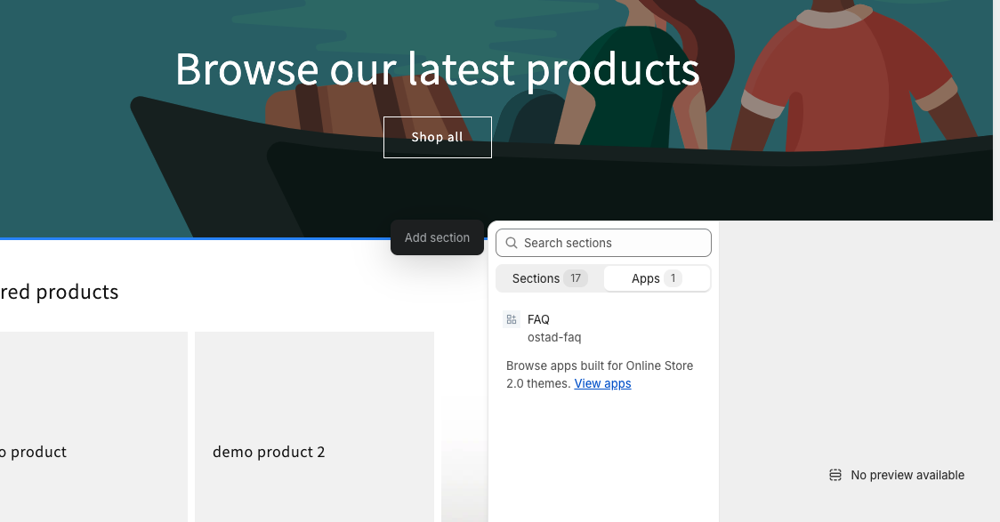

## Shopify FAQ

### Install

- Clone this repository or download
- run <code>npm install</code>
- run <code>npm run dev</code>
  - Select Partners organization
  - Select or Create App
  - Select Specific store for run this app
- Navigate to Shopify admin, go to <strong>Online Store</strong> &gt; <a href="https://admin.shopify.com/themes"><strong>Themes</strong></a>.
- Find the theme that you want to edit, and then click <strong>Customize</strong>.
- On top select products > default product page. that will navigate to you to product page
- Locate the appropriate location within the product page template where you want to add your theme extension. This could be above or below the product description, in the sidebar, or anywhere else on the page.
- Add FAQ app from App tab & configure it.
- Preview your store to view the app live.

### Requirements
- Node <code>18.12.0</code>
- Ruby <code>2.7.5</code> or greater

### Screenshots

